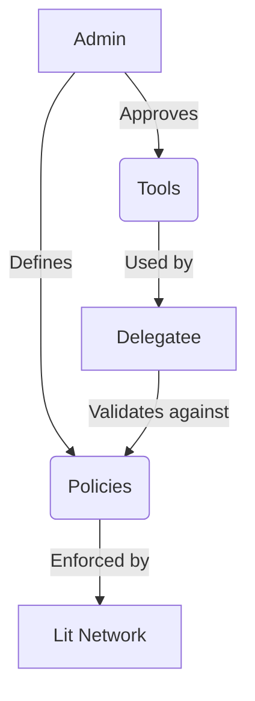

# Agent Wallet Overview

The Lit Agent Wallet (LAW) is a powerful tool that enables secure delegation of wallet operations through a system of administrators, delegatees, tools, and policies. It's built on top of Programmable Key Pairs (PKPs) and provides a flexible framework for managed wallet access.

## Core Concepts

### Admin
The admin is the owner of the Agent Wallet and has full control over its management. They are responsible for:
- Creating and managing PKPs (Agent Wallets)
- Adding and removing delegatees
- Registering and managing tools
- Setting and enforcing policies

### Delegatees
Delegatees are entities that can execute operations on behalf of the Agent Wallet. They:
- Must authenticate using Sign-in With Ethereum (SIWE)
- Can execute tools permitted by the admin
- Operate within the constraints of policies set by the admin
- Have access to specific PKPs assigned to them

### Tools
Tools are the building blocks of Agent Wallet functionality. They:
- Must be registered by the admin
- Can be permitted or unpermitted for specific delegatees
- Can be enabled or disabled without removal
- Execute specific operations on behalf of the Agent Wallet

### Policies
Policies are rules that govern how delegatees can use tools. They:
- Are immutable once published to IPFS
- Can restrict various parameters of tool execution
- Can be enabled or disabled by the admin
- Apply to specific delegatee-tool combinations

## Common Use Cases

1. **Managed Wallet Operations**
   - Admins can delegate specific wallet operations to trusted entities
   - Operations can be restricted by amount, recipient, or other parameters
   - Multiple delegatees can operate within defined boundaries

2. **Automated Transactions**
   - Delegatees can execute pre-approved transaction types
   - Policies ensure transactions stay within defined limits
   - Tools can be enabled/disabled as needed

3. **Multi-User Wallet Management**
   - Different delegatees can have different permissions
   - Policies can be tailored to each delegatee's role
   - Admin maintains ultimate control

## Getting Started

1. [Build Your First Agent](./building.md) - Learn how to set up and configure an Agent Wallet
2. [Create New Tools](./new-tool.md) - Understand how to extend functionality with custom tools

## Documentation Structure

- **[Admin Documentation](./references/admin/overview.md)**
  - Managing PKPs and ownership
  - Delegatee management
  - Tool registration and permissions
  - Policy creation and enforcement

- **[Delegatee Documentation](./references/delegatee/overview.md)**
  - Authentication and access
  - Tool execution
  - Understanding and working with policies

## Security Considerations

1. **Authentication**
   - Delegatees must authenticate using SIWE
   - Session signatures ensure secure operations
   - PKP ownership controls ultimate access

2. **Policy Enforcement**
   - Policies are immutable once published
   - Multiple layers of restrictions possible
   - Real-time policy checking during execution

3. **Access Control**
   - Granular permissions per delegatee
   - Tool-level access control
   - Policy-based parameter restrictions



## Getting Started

1. **Initialize System**
```bash
pnpm install && pnpm build
```

2. **Deploy Base Tools**
```bash
pnpm deploy:tools
```

3. **Launch CLI**
```bash
pnpm start:cli
```

> 📘 Next: [Create Custom Tools →](./new-tool.md) | [Configure Policies →](./building.md) | [Role Details →](./roles.md)

